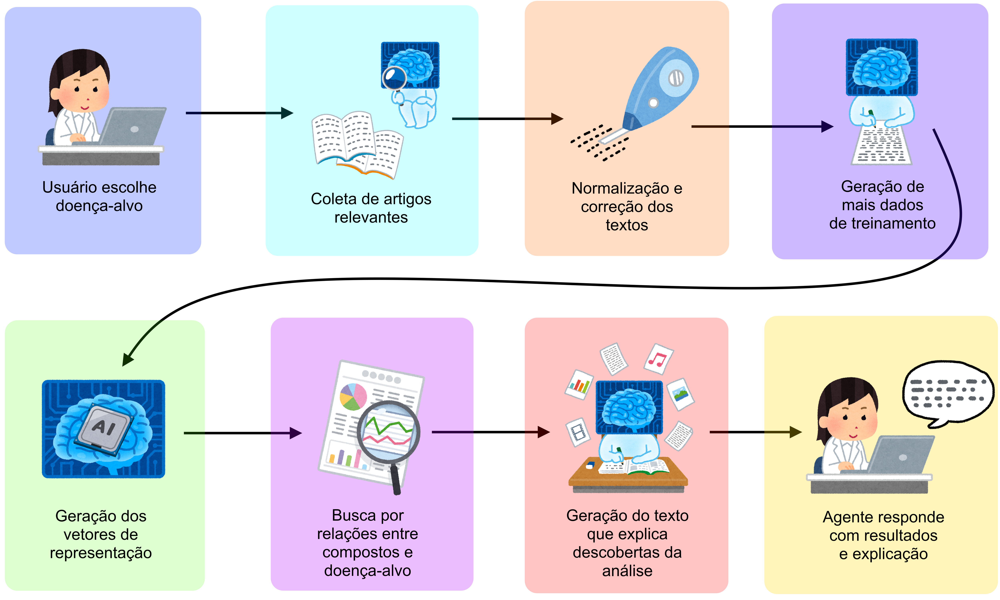

---

# XAI Framework for Latent Knowledge Discovery in Medical Literature


An end-to-end, XAI framework to uncover latent knowledge from scientific literature, with a focus on predicting future medical discoveries.

---

## Table of Contents

- [About The Project](#about-the-project)
- [Key Features](#key-features)
- [The Pipeline: How It Works](#the-pipeline-how-it-works)
- [Getting Started](#getting-started)
  - [Prerequisites](#prerequisites)
  - [Installation](#installation)
- [Usage](#usage)
- [Project Structure](#project-structure)
- [Contributing](#contributing)
- [License](#license)
- [Acknowledgments](#acknowledgments)

## About The Project

The volume of scientific literature is growing exponentially, making it impossible for researchers to manually track all advancements. This project addresses this challenge by providing an automated pipeline to analyze vast corpora of medical articles and identify "latent knowledge"—implicit relationships that may foreshadow future scientific breakthroughs.

Inspired by the work of [Tshitoyan et al. (2019)](https://www.nature.com/articles/s41586-019-1335-8) in materials science and its successful adaptation to medicine by [Berto et al. (2024)](https://doi.org/10.1016/j.eswa.2024.123566), this framework generalizes and extends the methodology. It uses a combination of classic word embeddings (Word2Vec, FastText) and modern Transformer models to trace the semantic relationship between a user-defined target disease and various chemical compounds over time.

The final output is an explainable report that provides context and evidence, helping researchers to generate and prioritize new hypotheses.



## Key Features

-   **End-to-End Pipeline**: A fully automated, menu-driven script (`run_pipeline.py`) that executes all steps from data collection to final report generation.
-   **Dynamic Query Generation**: Uses a topics of interest file to generate PubMed queries about subjects of interest for latent knowledge discovery regarding the target disease. Starts out with only the target disease and may be expanded with the best scoring compounds from the first run. This results in possible treatment compounds being added to the queries in the second run, expanding the context from only target-disease-related to general.
-   **Year-Over-Year Analysis**: Trains NLP models on cumulative, year-by-year corpora to track the evolution of semantic relationships over decades.
-   **Domain-Specific NER**: Uses specialized biomedical NER models (`en_ner_bc5cdr_md`) to accurately identify chemical and drug entities within the text.
-   **Scalable Data Processing**: Employs PySpark for efficient cleaning, normalization, and preparation of large text corpora.
-   **Explainable AI (XAI)**: Generates natural language explanations for the top-ranked compound-disease relationships, citing co-occurrence contexts from the source texts to build a narrative.
-   **Automated Reporting**: Produces a detailed LaTeX report with historical plots and AI-generated insights, ready for researcher review.

## The Pipeline: How It Works

This project is structured as a sequential pipeline, in which each script performs a specific task and prepares data for the next step.

1.  **`crawler.py` - PubMed Crawler**:
    -   Takes a user-defined disease as input.
    -   Uses a topics of interest file to fetch queries not only related to the disease, but everything else in it.
    -   Fetches the IDs and abstracts of all relevant papers and saves them as individual text files.

2.  **`merge_txt.py` - Corpus Aggregator**:
    -   Merges the individual abstract files into cumulative, year-over-year corpus files. For example, the file for 1995 contains all abstracts from the start year up to and including 1995.

3.  **`ner_table_generator.py` - NER Table Generator**:
    -   Processes the full corpus using a spaCy biomedical NER model.
    -   Identifies all entities labeled as `CHEMICAL` and saves them to a `ner_table.csv` for later use in normalization.

4.  **`clean_summaries.py` - Text Preprocessing**:
    -   A PySpark job that performs heavy-duty text cleaning.
    -   It normalizes text, removes stopwords, and crucially, uses a PubChem synonym database and the NER table to replace compound synonyms with a canonical name.
    -   Outputs a single `clean_abstracts.csv` file.

5.  **`train_yoy.py` - Year-Over-Year Model Training**:
    -   Iterates through each year of the study period.
    -   For each year, it trains a Word2Vec (or FastText) model on the corresponding cumulative corpus of cleaned abstracts.

6.  **`generate_dotproducts_csv.py` - Relationship Scoring**:
    -   Loads each year-over-year model.
    -   Calculates the dot product (a proxy for semantic similarity) between the vector for the target disease and the vectors for all chemical compounds present in corpus.
    -   Saves the historical scores for each compound in a separate CSV file.

7.  **`latent_knowledge_report.py` - Report Data Generation**:
    -   Analyzes the historical score data for all compounds.
    -   For each year, it ranks the compounds based on their relationship score with the disease and saves the top compounds to a file.
    -   This step prepares the data necessary for generating reports and visualizations, but no longer generates a PDF report itself.

8.  **`get_best_treatment_candidates.py` - Identify Top Candidates**:
    -   Reads the analysis results from the final year.
    -   Identifies the top 10 compounds based on the final 'score' metric.
    -   Saves this list of potential treatments to `potential_treatments.txt` for easy review.

9.  **`xai.py` - AI-Powered Explanation**:
    -   For the top-ranked compounds, it extracts sentences from the corpus where the compound and the disease co-occur.
    -   It feeds these "evidence sentences" to the Google Gemini API (temporary?) and prompts it to formulate a hypothesis explaining the potential connection, creating the XAI layer.

## Getting Started

Follow these instructions to set up and run the project locally.

### Prerequisites

-   Python 3.9+
-   A virtual environment tool (`venv`, `conda`, etc.)

### Installation

1.  **Clone the repository:**
    ```sh
    git clone https://github.com/tiribsil/we4lkd.git
    cd we4lkd
    ```

2.  **Create and activate a virtual environment:**
    ```sh
    # For Linux/macOS
    python3 -m venv venv
    source venv/bin/activate

    # For Windows
    python -m venv venv
    .\venv\Scripts\activate
    ```

3.  **Install the required Python packages:**
    ```sh
    pip install -r requirements.txt
    ```

4.  **Download the spaCy model:**
    This project is optimized for the biomedical NER model.
    ```sh
    python -m spacy download en_ner_bc5cdr_md
    ```

5.  **Download Titles and Filtered-Synonyms tables from PubMed:**

    Put them in /data/pubmed_data/
    
    https://ftp.ncbi.nlm.nih.gov/pubchem/Compound/Extras/.

## Usage

The entire pipeline is orchestrated by the `run_pipeline.py` script, which runs an automated, year-over-year analysis.

1.  **Set the Target Disease:**
    Before running, you must specify the disease you want to analyze in the `target_disease.txt` file.
    ```
    acute myeloid leukemia
    ```

2.  **Run the main script:**
    ```sh
    python run_pipeline.py
    ```

3.  **Automated Execution:**
    The script will automatically execute the entire pipeline in an iterative loop, starting from a configured year (e.g., 1970) up to the current year. For each year, it performs all steps from crawling to analysis.

4.  **Feedback Loop:**
    A key feature of the new pipeline is the automated feedback loop. After each full iteration (i.e., after processing a year), the script identifies the top treatment candidates and can automatically add them to the `topics_of_interest.txt` file. This allows the crawler to broaden its search in subsequent iterations, creating a powerful discovery cycle.

## Project Structure

```
.
├── data/
│   ├── {disease_name}/              # All data for a specific disease
│   │   ├── corpus/
│   │   │   ├── raw_abstracts/       # Step 1: Individual crawled abstracts
│   │   │   ├── aggregated_abstracts/  # Step 2: Cumulative yearly files
│   │   │   ├── ner_table.csv        # Step 3: NER results
│   │   │   └── clean_abstracts/     # Step 4: Cleaned, normalized abstracts
│   │   ├── models/                  # Step 5: Year-over-year Word2Vec/FastText models
│   │   └── validation/
│   │       ├── {model_type}/
│   │       │   ├── compound_history/  # Step 6: Historical dot product scores
│   │       │   ├── top_n_compounds/ # Step 7: Top compounds per year
│   │       │   └── xai/             # Step 9: AI-generated explanations
│   │       └── reports/               # Step 7: Final LaTeX/PDF reports
│   └── pubchem_data/                # Static data for synonym normalization
├── src/
|   ├── crawler.py
|   ├── merge_txt.py
|   ├── ner_table_generator.py
|   ├── clean_summaries.py
|   ├── train_yoy.py
|   ├── generate_dotproducts_csv.py
|   ├── latent_knowledge_report.py
|   ├── get_best_treatment_candidates.py
|   ├── xai.py
│   └── utils.py                     # Utility functions
├── api_key.py                       # (User-created, temporary?) Google API Key
├── latent_knowledge_template.tex    # Template for the final report
├── README.md
├── requirements.txt
├── run_pipeline.py                  # Main execution script
└── target_disease.txt               # (User-created) Target disease name
```

## Contributing


## License


## Acknowledgments

-   This project is an extension of the methodologies presented in:
    -   [Tshitoyan et al., *Nature* (2019)](https://www.nature.com/articles/s41586-019-1335-8)
    -   [Berto et al., *Expert Systems with Applications* (2024)](https://doi.org/10.1016/j.eswa.2024.123566)
-   This work is based on an undergraduate research proposal for FAPESP.
-   Special thanks to Prof. Dr. Tiago Agostinho de Almeida (UFSCar) for his guidance and supervision.
-   Universidade Federal de São Carlos (UFSCar), Sorocaba Campus.
