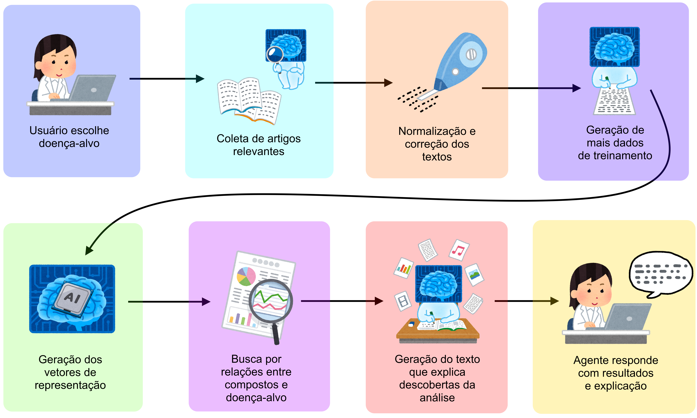

---

# XAI Framework for Latent Knowledge Discovery in Medical Literature


An end-to-end, XAI framework to uncover latent knowledge from scientific literature, with a focus on predicting future medical discoveries.

---

## Table of Contents

- [About The Project](#about-the-project)
- [Key Features](#key-features)
- [The Pipeline: How It Works](#the-pipeline-how-it-works)
- [Getting Started](#getting-started)
  - [Prerequisites](#prerequisites)
  - [Installation](#installation)
- [Usage](#usage)
- [Project Structure](#project-structure)
- [Contributing](#contributing)
- [License](#license)
- [Acknowledgments](#acknowledgments)

## About The Project

The volume of scientific literature is growing exponentially, making it impossible for researchers to manually track all advancements. This project addresses this challenge by providing an automated pipeline to analyze vast corpora of medical articles and identify "latent knowledge"—implicit relationships that may foreshadow future scientific breakthroughs.

Inspired by the work of [Tshitoyan et al. (2019)](https://www.nature.com/articles/s41586-019-1335-8) in materials science and its successful adaptation to medicine by [Berto et al. (2024)](https://doi.org/10.1016/j.eswa.2024.123566), this framework generalizes and extends the methodology. It uses a combination of classic word embeddings (Word2Vec, FastText) and modern Transformer models to trace the semantic relationship between a user-defined target disease and various chemical compounds over time.

The final output is an explainable report that provides context and evidence, helping researchers to generate and prioritize new hypotheses.



## Key Features

-   **Modular 5-Phase Pipeline**: A restructured, checkpointed pipeline (`modularization/main.py`) that organizes the workflow into discrete, logical stages.
-   **Automated Topic Expansion**: Uses Iterative Topic Expansion to dynamically broaden the literature search based on discovery potential.
-   **LHS-Driven Model Selection**: Explores the hyperparameter space (Word2Vec, FastText) using Latin Hypercube Sampling (LHS) to find the optimal architecture for a specific disease.
-   **Year-Over-Year Analysis**: Trains NLP models on cumulative, year-by-year corpora to track the evolution of semantic relationships over decades.
-   **Scalable Preprocessing**: Employs efficient cleaning and normalization, including a PubChem synonym mapping system.
-   **Explainable AI (XAI)**: Uses LLMs (BioMistral/Mistral) to generate natural language hypotheses and contextualize the top-ranked compound-disease relationships.
-   **Automated Reporting**: Produces a detailed LaTeX report with historical plots and metrics like "Mean Years Early" anticipation.

## The Pipeline: How It Works

The project is now divided into 5 main phases, orchestrated by `modularization/main.py`:

### Phase 1: Expansion (`topic_expansion.py`)
Identifies relevant topics and expansion terms for the target disease using an iterative process. This ensures the corpus includes not just the disease itself, but its broader medical context.

### Phase 2: Development (`data_collection.py`, `preprocessing.py`, `embedding_training.py`)
1.  **Data Collection**: Crawls PubMed for abstracts based on the expanded topics.
2.  **Preprocessing**: Standardizes text, removes noise, and normalizes chemical names using PubChem synonyms.
3.  **Candidate Training**: Trains a suite of candidate embedding models (Word2Vec/FastText) using various hyperparameter combinations selected via LHS.

### Phase 3: Selection (`model_selection.py`)
Evaluates all candidate models against a "Ground Truth" (historical discovery years extracted from the corpus in `ground_truth.py`). It selects the model architecture that best "predicts" known discoveries before they were officially reported.

### Phase 4: Evaluation (`model_evaluation.py`, `reporting.py`)
Perform a final, rigorous assessment of the best model. It executes incremental training and generates:
-   Historical similarity rankings.
-   Anticipation metrics (how many years early the model would have predicted treatments).
-   A complete LaTeX/PDF report with visualizations.

### Phase 5: Summary (`contextualization.py`)
The final XAI layer. It takes the top-ranked candidates for the current year and uses an LLM to build scientific hypotheses, citing potential mechanisms of action discovered in its knowledge base.

## Getting Started
### Prerequisites

-   Python 3.10+
-   `requirements.txt` dependencies (pandas, gensim, spacy, etc.)
-   `en_ner_bc5cdr_md` spacy model.

### Installation

1.  **Clone the repository:**
    ```sh
    git clone https://github.com/tiribsil/we4lkd.git
    cd we4lkd
    ```

2.  **Setup Environment:**
    ```sh
    python3 -m venv venv
    source venv/bin/activate
    pip install -r requirements.txt
    python -m spacy download en_ner_bc5cdr_md
    ```

## Usage

The pipeline is now centered in the `modularization` directory.

1.  **Set the Target Disease**:
    Specify the disease in `target_disease.txt` (root).
    ```
    acute myeloid leukemia
    ```

2.  **Configure `.env`**:
    Provide your API keys and paths if necessary in the `.env` file.

3.  **Run the Pipeline**:
    The main entry point is `modularization/main.py`.
    ```sh
    python modularization/main.py
    ```

4.  **Checkpoints**:
    The pipeline saves its state in `artifacts/`. If interrupted, it will resume from the last successful phase.

## Project Structure

```
.
├── modularization/          # Core Logic
│   ├── main.py              # Pipeline Entry Point
│   ├── topic_expansion.py   # Phase 1: Topic crawler/expander
│   ├── data_collection.py   # Phase 2: PubMed crawler
│   ├── preprocessing.py     # Phase 2: Text cleaning & normalization
│   ├── embedding_training.py# Phase 2: Model training (merged)
│   ├── metric_generation.py # Phase 2: Similarity metrics
│   ├── model_selection.py   # Phase 3: Selection Logic
│   ├── model_evaluation.py  # Phase 4: Final Evaluation
│   ├── reporting.py         # Phase 4: LaTeX Report Generator
│   ├── ground_truth.py      # Shared Logic: Literature-based discovery years
│   ├── contextualization.py # Phase 5: LLM Hypotheses
│   └── utils.py             # Logging and helpers
├── data/                    # Generated data and corpora
├── artifacts/               # Checkpoints
├── logs/                    # Pipeline execution logs
├── requirements.txt         # Dependencies
└── README.md
```

## Contributing


## License


## Acknowledgments

-   This project is an extension of the methodologies presented in:
    -   [Tshitoyan et al., *Nature* (2019)](https://www.nature.com/articles/s41586-019-1335-8)
    -   [Berto et al., *Expert Systems with Applications* (2024)](https://doi.org/10.1016/j.eswa.2024.123566)
-   This work is based on an undergraduate research proposal for FAPESP.
-   Special thanks to Prof. Dr. Tiago Agostinho de Almeida (UFSCar) for his guidance and supervision.
-   Universidade Federal de São Carlos (UFSCar), Sorocaba Campus.
